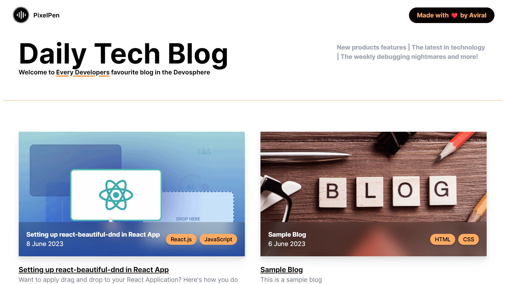

# pixelpen-blog
PixelPen is a blogging web app that allows users to read daily technical blogs. It is built using Next.js 13 and utilizes Sanity v3 as the content management system (CMS) for organizing and presenting the blog content.



## ⚙️ Built With
* [](https://react.dev/)
* [](https://nextjs.org/)
* [](https://tailwindcss.com/)
* [Sanity CMS](https://www.sanity.io/)

## Local Setup & Installation
* Clone the repo https://github.com/aviralj02/pixelpen-blog.git
```
$ git clone 
```
* Install NPM Packages
```
$ npm install
```
* Spin up the development server
```
$ npm run dev
```